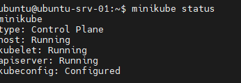
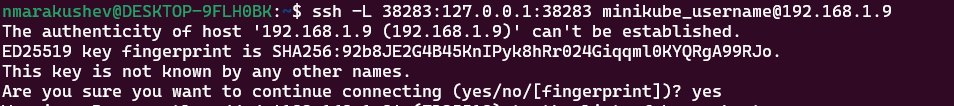
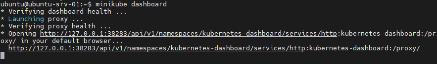

1) First you need to update the dependencies on your machine: <br>
```sudo apt update```
2) Next, you need to install the necessary packages.: <br>
```sudo apt install -y apt-transport-https ca-certificates curl```
3) Install the necessary packages.: <br>
```sudo apt install -y docker.io & sudo systemctl enable --now docker``` <br>
Add user to group:
```sudo usermod -aG docker $USER & newgrp docker```
4) Install kubectl: <br>
```curl -LO "https://dl.k8s.io/release/$(curl -L -s https://dl.k8s.io/release/stable.txt)/bin/linux/amd64/kubectl"``` <br>
```sudo install -o root -g root -m 0755 kubectl /usr/local/bin/kubectl``` <br>
```kubectl version --client --output=yaml``` <br>

7) Install minikube:
```curl -LO https://storage.googleapis.com/minikube/releases/latest/minikube-linux-amd64``` <br>
```sudo install minikube-linux-amd64 /usr/local/bin/minikube``` <br>
```minikube version``` 

8) Create a non-root user:
```sudo adduser minikube_username```
```sudo usermod -aG docker minikube_username```

9) Start minikube and check status:
```minikube start --driver=docker``` <br>
```minikube status``` <br>
```kubectl get nodes``` <br>


10) Access minikube dashboard:
find out your port, for example 38283
```ssh -L 38283:127.0.0.1:38283 minikube_username@192.168.1.9```


11) Then open: <br>
```http://127.0.0.1:38283/api/v1/namespaces/kubernetes-dashboard/services/http:kubernetes-dashboard:/proxy/#/workloads?namespace=default```


use should use added previously user to connect